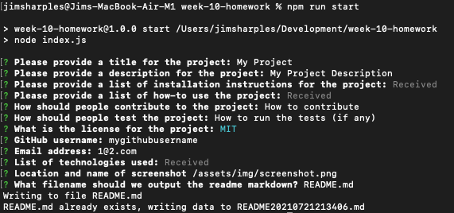

# Professional README Generator      

# Table of Contents
- [Project Description](#project-description)
- [Installation Instructions](#installation-instructions)
- [Usage](#usage)
- [Screenshot](#screenshot)
- [How To Contribute](#how-to-contribute)
- [Technology](#technology)
- [Questions](#questions)
- [License](#license)

# Project Description
This small command line interface (CLI) application will prompt the user to provide information that will be used to create the outline of a useful README.md skeleton for a new project in GitHub.  By answering each question a good quality README.md markup will be created.

# Installation Instructions

1.  Install node.js (http://nodejs.org/)
2.  Using the installed Node Package Manager `npm` execute `npm install` to install the required libraries.

# Usage

To execute the application, user a command line interface (CLI) such as terminal and run `npm run start`

# Screenshot

## How to contribute

Please access the [Questions](#questions) section to send me an email or access the repository if you wish to help contribute to this project.

# Technology 

 1. Node.js
2. NPM
3. [Inquirer](https://npmjs.com/package/inquirer)
4. [Moment](https://npmjs.com/package/moment)
5. [Markdown License badges](https://gist.github.com/lukas-h/2a5d00690736b4c3a7ba)
 

# Questions

>  **Direct your questions about this project to:**
>
>  *GitHub:* [jsharples777](https://github.com/jsharples777/week-10-homework)
>
>  *Email:* [jamie.sharples@gmail.com](mailto:jamie.sharples@gmail.com)

# License

### [MIT License](https://opensource.org/licenses/MIT)
A short and simple permissive license with conditions only requiring preservation of copyright and license notices. Licensed works, modifications, and larger works may be distributed under different terms and without source code.